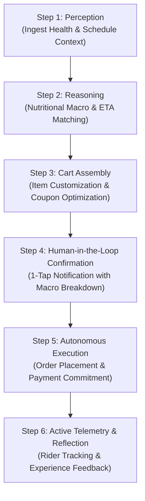

# Session 19 – Task 4: Agentic AI in Food Delivery (Zomato / Swiggy)

## 1. AI-Generated Ideation: Automating Food Delivery with Agentic AI

Using generative AI tools (ChatGPT / Copilot), five high-impact agentic concepts were brainstormed for next-generation food delivery platforms like **Zomato** and **Swiggy**:

1. **Autonomous Group Meal Negotiator**: An agent that aggregates food preferences, allergies, and budgets from multiple friends in a group chat, negotiates a consensus restaurant, builds a unified cart, and splits the bill automatically.
2. **Context-Aware Dietary & Health Replenisher ("NutriCraver Agent")** *(SELECTED)*: Connects to health wearables (Apple Health / Fitbit) and calendars to autonomously recommend and schedule macro-balanced meals matching calories burned.
3. **Surge & Monsoon Proactive Logistics Agent**: Anticipates severe weather and kitchen backlogs, pre-warning users and rerouting delivery orders to cloud kitchens with dedicated indoor rider hubs.
4. **Dynamic Smart-Savings & Deal Hunter Agent**: Continuously tracks platform discounts, bank credit card offers, and bundled items to assemble the lowest-cost meal basket without user effort.
5. **Real-Time Quality & Missing Item Dispute Agent**: Inspects user-uploaded meal photos using multimodal vision models, verifies missing items against the bill, and executes instant refunds or redeliveries without customer support queues.

---

## 2. Selected Feature: Context-Aware Dietary & Health Replenisher Agent

### Concept Overview:
The **NutriCraver Agent** transforms food delivery from a passive search-and-order app into an autonomous proactive nutrition concierge. It monitors user workout intensity, calendar schedules, and dietary restrictions, then autonomously plans, prepares, and presents tailored meal orders at the exact right moment.

---

## 3. End-to-End Agentic Workflow (6 Structured Steps)

### Step 1: Contextual Perception (Multi-Sensor Trigger)
- **Inputs Ingested**:
  - Wearable Health Sync: User completed a 45-minute HIIT workout burning 480 kcal.
  - User Nutritional Profile: Target: High Protein (30g+), Low Carb, Pure Vegetarian.
  - Calendar Perception: User has a Zoom meeting ending at 1:15 PM and free until 2:00 PM.
  - Location: User is at work (Lower Parel, Mumbai).

### Step 2: Reasoning & Restaurant Search (Agentic Filtering)
- The agent queries the Zomato partner API for restaurants within 3.5 km with delivery time $\le 30\text{ minutes}$.
- Scans item-level nutritional manifests and customer ratings.
- Evaluates candidate meals against target criteria:
  - *Candidate A*: Paneer Tikka Salad (420 kcal, 32g protein, 22 min ETA) ➔ **Match Score: 96%**
  - *Candidate B*: Veggie Burger & Fries (850 kcal, 14g protein, 35 min ETA) ➔ **Rejected (Exceeds calorie goal)**

### Step 3: Cart Assembly & Customization (Autonomous Staging)
- Builds the order basket with customized preparation instructions:
  - *"Dressing on the side, no added refined sugar, extra grilled paneer."*
- Runs the coupon optimizer tool, applying a 20% healthy-eating promotional voucher (`HEALTHY20`), reducing total bill from ₹450 to ₹360.

### Step 4: Proactive Human-in-the-Loop Confirmation
- Rather than blindly charging the user, the agent delivers a rich interactive push notification:
  > **NutriCraver Agent**: *"Great workout! You burned 480 kcal. To hit your protein goal, I staged a **Grilled Paneer Superbowl** from Green Theory for **₹360** (420 kcal, 32g Protein). Deliver at **1:15 PM** when your meeting ends? [Approve (1-Tap)] [Swap Dish] [Skip]"*

### Step 5: Autonomous Execution & Payment Dispatch
- Upon single-tap user approval (or pre-authorized automated ordering threshold):
  - Commits the transaction via tokenized UPI/Saved Card.
  - Dispatches order to the restaurant kitchen with scheduled dispatch timing.

### Step 6: Active Telemetry & Reflection
- Continuously monitors delivery telemetry: GPS location of rider, prep time, and weather conditions.
- If a 10-minute rain delay is detected, sends an ambient notification and adjusts schedule.
- Post-delivery: Prompts for a 1-second satisfaction rating to update user's taste memory graph.
