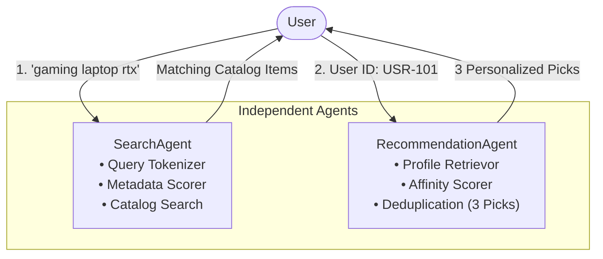
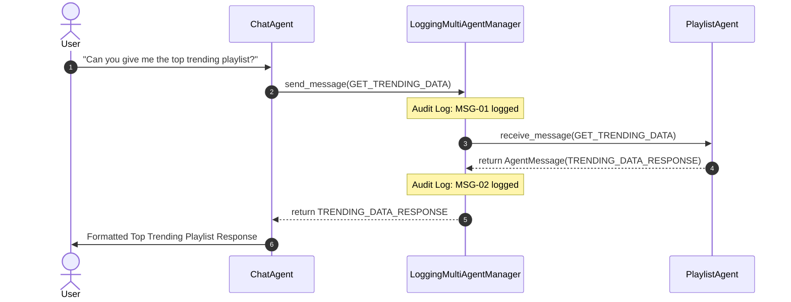
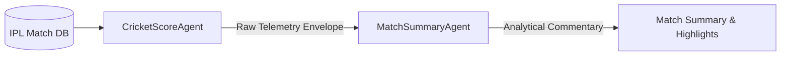

# Session 20: Agentic AI with LLMs (Part 3) – Multi-Agent Systems

This directory contains the complete implementation, automated test suite, and architectural documentation for **Session 20: Multi-Agent Systems**. All tasks are implemented in modular, self-contained Python scripts equipped with Windows UTF-8 safety, comprehensive error handling, and structured telemetry.

---

## 📋 Task Overview & File Mapping

| Task | Topic | Key Files | Description |
| :--- | :--- | :--- | :--- |
| **Task 1** | Independent E-Commerce Agents | [`task1_flipkart_agents.py`](file:///d:/tops%20data/Agentic%20AI/Assignment/Session%2020/task1_flipkart_agents.py) | `SearchAgent` (keyword discovery) and `RecommendationAgent` (profile-based 3-product recommendations) operating independently in a Flipkart shopping assistant simulation. |
| **Task 2** | Multi-Agent Coordination | [`task2_spotify_multi_agent_manager.py`](file:///d:/tops%20data/Agentic%20AI/Assignment/Session%2020/task2_spotify_multi_agent_manager.py) | `MultiAgentManager` orchestrating task delegation between `ChatAgent` (natural language front-end) and `PlaylistAgent` (domain music curator) for Spotify. |
| **Task 3** | Information Sharing & Message Bus | [`task3_agent_information_sharing.py`](file:///d:/tops%20data/Agentic%20AI/Assignment/Session%2020/task3_agent_information_sharing.py) | Extended `LoggingMultiAgentManager` implementing an explicit message-passing protocol (`AgentMessage`), trending data exchange, and complete audit logging. |
| **Task 4** | AI Code Generation & Refactoring | [`task4_ipl_multi_agent.py`](file:///d:/tops%20data/Agentic%20AI/Assignment/Session%2020/task4_ipl_multi_agent.py)<br>[`task4_ai_generation_notes.md`](file:///d:/tops%20data/Agentic%20AI/Assignment/Session%2020/task4_ai_generation_notes.md) | Multi-agent IPL score fetcher (`CricketScoreAgent`) and summary analyzer (`MatchSummaryAgent`). Includes documentation on LLM generation prompt, raw code flaws, and refactoring steps. |
| **Testing** | Automated Unit & Integration Suite | [`test_session20.py`](file:///d:/tops%20data/Agentic%20AI/Assignment/Session%2020/test_session20.py) | `unittest` test suite covering all agent behaviors, delegation paths, message logs, and edge cases. |

---

## 🏗️ Architecture & Interaction Flows

### 1. Task 1: Independent E-Commerce Agents
In a decoupled multi-agent shopping architecture, `SearchAgent` parses user search intent over product metadata, while `RecommendationAgent` queries user taste vectors (preferences, category affinities, past purchases) without dependency on the search agent:



---

### 2. Task 2 & 3: Multi-Agent Coordination & Information Sharing
In Tasks 2 and 3, agents communicate via a centralized manager that acts as both a service registry and a message bus. When a user requests a "top trending playlist", `ChatAgent` does not have trending metrics directly; it requests data from `PlaylistAgent` through the manager, which logs the interaction:



---

### 3. Task 4: Cricket Score Telemetry & Commentary Pipeline
`CricketScoreAgent` acts as the sensory / data ingestion node, while `MatchSummaryAgent` acts as the cognitive / reasoning node that performs mathematical analysis (Current Run Rate, Required Run Rate, balls remaining, match prediction):



---

## 🚀 Execution & Verification Guide

All scripts can be executed directly from the workspace root or inside the `Session 20` directory:

### 1. Run Task 1 (Independent Flipkart Agents)
```bash
python "Assignment/Session 20/task1_flipkart_agents.py"
```
*Output Highlights*: Demonstrates keyword scoring on laptops, audio, and wearables, followed by 3 personalized picks for 4 distinct user profiles (Aarav, Priya, Rohan, and Guest).

### 2. Run Task 2 (Spotify MultiAgentManager)
```bash
python "Assignment/Session 20/task2_spotify_multi_agent_manager.py"
```
*Output Highlights*: ChatAgent classifies greetings vs. playlist requests, passes workout and lofi requests to PlaylistAgent, and formats Spotify track cards.

### 3. Run Task 3 (Information Sharing & Message Audit Log)
```bash
python "Assignment/Session 20/task3_agent_information_sharing.py"
```
*Output Highlights*: ChatAgent requests real-time trending metrics from PlaylistAgent. Both outgoing requests and incoming replies are stamped with timestamps and logged to an audit trail.

### 4. Run Task 4 (IPL Multi-Agent System)
```bash
python "Assignment/Session 20/task4_ipl_multi_agent.py"
```
*Output Highlights*: Fetches completed matches (CSK vs MI) and live chase equations (RCB vs KKR), calculating Required Run Rates dynamically.

### 5. Run the Automated Unit Test Suite
```bash
python "Assignment/Session 20/test_session20.py"
```
*Output*:
```text
Ran 5 tests in 0.002s
OK
```

---

## 📊 Summary of Test Coverage

| Test Case | Method | Assertion Details |
| :--- | :--- | :--- |
| `test_task1_search_agent_matching` | `SearchAgent.search()` | Verifies keyword scoring, brand matches, and graceful handling of empty queries. |
| `test_task1_recommendation_agent_personalization` | `RecommendationAgent.get_recommendations()` | Asserts exactly 3 picks returned, exclusion of prior purchases, and guest fallback. |
| `test_task2_spotify_manager_coordination` | `SpotifyManager.handle_user_query()` | Tests agent registration, conversational fallback, and delegated playlist creation. |
| `test_task3_information_sharing_and_logs` | `LoggingMultiAgentManager.send_message()` | Verifies bi-directional message handshake, payload integrity, and audit log tracking. |
| `test_task4_cricket_multi_agent_pipeline` | `IPLMultiAgentSystem.process_match()` | Tests completed match summaries, live chase RRR computation, and invalid ID error handling. |
