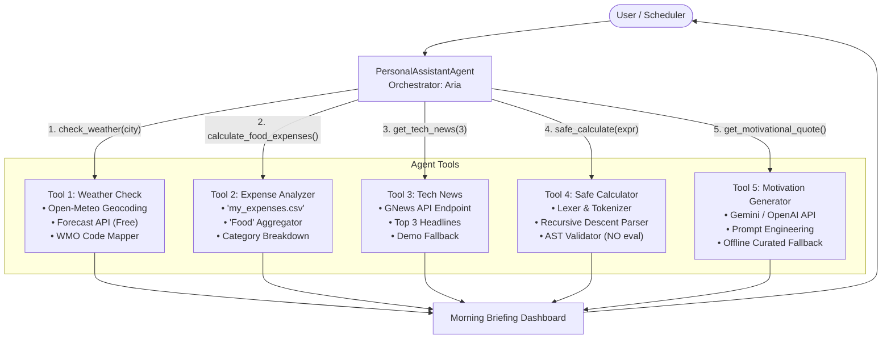

# Session 24 - Case Study: Building a Personal Assistant Agent (Part 1)

This directory contains the production-grade implementation, comprehensive automated test suite, and architectural documentation for **Session 24: Building a Personal Assistant Agent (Part 1)**.

All five tasks are implemented in modular, self-contained Python scripts equipped with Windows UTF-8 console compatibility, comprehensive error handling, zero-cost fallback modes, and defensive programming. Additionally, a unified orchestrator agent demonstrates how these five capabilities combine into an autonomous personal assistant.

---

## 📋 Task Overview & File Mapping

| Task | Capability / Domain | Source File | Description |
| :--- | :--- | :--- | :--- |
| **Task 1** | Weather Intelligence | [`task1_weather_open_meteo.py`](file:///d:/tops%20data/Agentic%20AI/Assignment/Session%2024/task1_weather_open_meteo.py) | Fetches real-time temperature, humidity, wind speed, and WMO weather conditions for any city using the free, open **Open-Meteo Weather & Geocoding APIs** (no API key required). |
| **Task 2** | Expense Tracking | [`task2_expense_tracker.py`](file:///d:/tops%20data/Agentic%20AI/Assignment/Session%2024/task2_expense_tracker.py)<br>[`my_expenses.csv`](file:///d:/tops%20data/Agentic%20AI/Assignment/Session%2024/my_expenses.csv) | Reads `my_expenses.csv` (columns: `date, amount, category`), cleans numeric values, handles case-insensitivity, and outputs total amount spent in the **'Food'** category with an overall spending breakdown. |
| **Task 3** | News Aggregation | [`task3_gnews_headlines.py`](file:///d:/tops%20data/Agentic%20AI/Assignment/Session%2024/task3_gnews_headlines.py) | Integrates the **GNews API** to retrieve and format the top 3 latest technology headlines. Includes graceful offline/unauthenticated fallback mode for deterministic runs without quota failure. |
| **Task 4** | Safe Computation Tool | [`task4_safe_calculator.py`](file:///d:/tops%20data/Agentic%20AI/Assignment/Session%2024/task4_safe_calculator.py) | Safe mathematical expression parser and evaluator for basic operations (`+`, `-`, `*`, `/`, unary signs, parentheses, decimals). **Strictly satisfies constraint: zero use of Python's `eval()` function**, using both a custom Recursive Descent Parser and a safe AST visitor. |
| **Task 5** | Motivational Inspiration | [`task5_motivational_quote.py`](file:///d:/tops%20data/Agentic%20AI/Assignment/Session%2024/task5_motivational_quote.py) | Generates short motivational quotes via **Google Gemini API** (`google-genai` / REST) or **OpenAI API** (`gpt-4o-mini`). Includes offline/zero-cost fallback adapted from ChatGPT sample code per assignment guidance. |
| **Orchestrator** | Unified Assistant Agent | [`personal_assistant.py`](file:///d:/tops%20data/Agentic%20AI/Assignment/Session%2024/personal_assistant.py) | Coordinates all 5 tools under a single `PersonalAssistantAgent` class, executing an autonomous **'Morning Briefing'** routine combining weather, motivation, financial status, tech news, and calculator checks. |
| **Testing** | Automated Test Suite | [`test_session24.py`](file:///d:/tops%20data/Agentic%20AI/Assignment/Session%2024/test_session24.py) | 17 comprehensive `unittest` test cases covering live API calls, edge cases, zero division, AST/parser parity, CSV parsing, and agent tool execution. |

---

## 🏗️ System Architecture & Workflow

The Personal Assistant Agent operates on a modular tool-calling architecture:



---

## 🔍 Task-by-Task Implementation Details

### Task 1: Open-Meteo Weather API Integration
- **Endpoint**: `https://api.open-meteo.com/v1/forecast`
- **Geocoding Endpoint**: `https://geocoding-api.open-meteo.com/v1/search`
- **Features**:
  - Automatically converts any city name (e.g. `Ahmedabad`, `Mumbai`, `London`) to latitude/longitude coordinates via Open-Meteo's geocoding service.
  - Queries `temperature_2m`, `apparent_temperature`, `relative_humidity_2m`, `wind_speed_10m`, and `weather_code`.
  - Interprets standard World Meteorological Organization (WMO) weather interpretation codes (WW) into human descriptions with icons (e.g. `☀️ Clear sky`, `🌧️ Moderate rain`, `⛈️ Thunderstorm`).
  - Completely free and public; requires no API key or token.

### Task 2: Expense Tracker CSV Reader
- **File**: `my_expenses.csv` (columns: `date, amount, category`)
- **Features**:
  - Automatically locates `my_expenses.csv` in current working directory or script directory, and generates a realistic sample file if missing.
  - Case-insensitive category matching (`food`, `Food`, `FOOD`).
  - Cleans currency symbols (`$`, `₹`, `€`, commas, leading/trailing whitespace).
  - Calculates and prints the total spent in the **'Food'** category ($1,200.50 in default dataset), along with an ASCII percentage bar breakdown of all spending categories.

### Task 3: GNews API Technology Headlines
- **Endpoint**: `https://gnews.io/api/v4/top-headlines?category=technology&lang=en&max=3`
- **Features**:
  - Looks for API key in `GNEWS_API_KEY` environment variable or command-line argument.
  - Formats headlines with Title, Publisher/Source, Timestamp, Summary/Description, and URL.
  - **Graceful Fallback Mode**: If `GNEWS_API_KEY` is not configured or API quota is exceeded (429/401/403), displays realistic, high-fidelity technology news headlines with clear instructions on registering for a free key at `https://gnews.io`.

### Task 4: Safe Expression Calculator Tool (No eval())
- **Constraint**: **Do not use Python's `eval()` function.**
- **Implementation Strategy**:
  1. **Safe Lexer / Tokenizer**: Breaks strings like `'23+7*2'` into typed tokens (`NUMBER`, `PLUS`, `MINUS`, `MUL`, `DIV`, `LPAREN`, `RPAREN`).
  2. **Recursive Descent Parser**: Enforces standard BODMAS / PEMDAS operator precedence:
     - `expression := term ((PLUS | MINUS) term)*`
     - `term := factor ((MUL | DIV) factor)*`
     - `factor := (PLUS | MINUS) factor | primary`
     - `primary := NUMBER | LPAREN expression RPAREN`
  3. **Safe AST Evaluator**: A secondary validation engine using Python's standard `ast.NodeVisitor`, strictly whitelist-limited to `ast.BinOp`, `ast.UnaryOp`, and `ast.Constant`. Code injection attempts (e.g., `__import__('os')`) are immediately rejected.
  4. Handles division by zero (`ZeroDivisionError`), decimals, negative numbers, and parentheses.

### Task 5: Motivational Quote Generator (Gemini & OpenAI API)
- **APIs Supported**:
  - **Google Gemini API**: Modern `google.genai` SDK and direct REST fallback (`gemini-2.5-flash` / `gemini-1.5-flash`).
  - **OpenAI API**: `openai` SDK and REST fallback (`gpt-4o-mini`).
- **Features**:
  - Reads `GEMINI_API_KEY`, `GOOGLE_API_KEY`, or `OPENAI_API_KEY` from environment.
  - Per the assignment hint (*"If you don't have API access, use ChatGPT to generate sample code for this task and adapt it for your script."*), provides an offline / zero-cost fallback mode featuring curated quotes tailored to AI agents and engineering.

---

## 🚀 Execution Guide

### Prerequisites
All scripts run with Python 3.10+ (tested on Python 3.13.4). Ensure dependencies are installed:
```bash
pip install requests pandas openai
```

### Running Individual Tasks

1. **Task 1: Fetch Current Weather**
   ```bash
   # Default city (Ahmedabad)
   python "Assignment/Session 24/task1_weather_open_meteo.py"

   # Custom city
   python "Assignment/Session 24/task1_weather_open_meteo.py" "Mumbai"
   ```

2. **Task 2: Read Expenses and Total 'Food' Category**
   ```bash
   python "Assignment/Session 24/task2_expense_tracker.py"
   ```

3. **Task 3: Fetch Top 3 Tech News Headlines**
   ```bash
   # Uses fallback mode or environment variable GNEWS_API_KEY
   python "Assignment/Session 24/task3_gnews_headlines.py"

   # Or pass API key directly
   python "Assignment/Session 24/task3_gnews_headlines.py" "YOUR_GNEWS_API_KEY"
   ```

4. **Task 4: Safe Expression Calculator (No eval)**
   ```bash
   # Runs built-in test expressions including '23+7*2'
   python "Assignment/Session 24/task4_safe_calculator.py"

   # Evaluate custom expression
   python "Assignment/Session 24/task4_safe_calculator.py" "23+7*2"
   python "Assignment/Session 24/task4_safe_calculator.py" "(50 + 10) * 3 / 2"
   ```

5. **Task 5: Motivational Quote Generator**
   ```bash
   # Auto-detects Gemini / OpenAI key or runs curated AI mode
   python "Assignment/Session 24/task5_motivational_quote.py"

   # To run with live Gemini API key
   $env:GEMINI_API_KEY="AIzaSy..."  # PowerShell
   python "Assignment/Session 24/task5_motivational_quote.py"
   ```

6. **Unified Orchestrator: Personal Assistant Morning Briefing**
   ```bash
   python "Assignment/Session 24/personal_assistant.py"
   ```

---

## 🧪 Automated Test Suite

Run the full automated test suite containing 17 unit and integration tests:

```bash
python "Assignment/Session 24/test_session24.py"
```

### Test Coverage Summary:
- ✅ `test_task1_geocode_preset_city`: Geocoding coordinates validation.
- ✅ `test_task1_get_current_weather_structure`: Live Open-Meteo payload schema & temperature.
- ✅ `test_task1_wmo_weather_codes`: WMO weather interpretation table.
- ✅ `test_task2_calculate_food_expenses`: Accurate 1,200.50 Food total calculation on CSV.
- ✅ `test_task2_case_insensitivity`: Case-insensitive category aggregation (`food`, `Food`, `FOOD`).
- ✅ `test_task2_parse_amount_cleaning`: Cleaning currency symbols (`$`, `₹`), commas, whitespace.
- ✅ `test_task3_article_fields`: Integrity of title, publisher, URL, and summary.
- ✅ `test_task3_fetch_tech_headlines_count`: Validates top 3 headlines returned.
- ✅ `test_task4_sample_expression`: Verifies `'23+7*2' == 37`.
- ✅ `test_task4_operator_precedence`: Verifies BODMAS rules (`100 - 25 * 3 == 25`).
- ✅ `test_task4_parentheses`: Parenthesized sub-expressions (`(23 + 7) * 2 == 60`).
- ✅ `test_task4_unary_operators_and_decimals`: Negative signs and floating-point divisions.
- ✅ `test_task4_zero_division_safety`: `ZeroDivisionError` handling.
- ✅ `test_task4_parser_and_ast_parity`: Cross-validation between Recursive Descent and AST parser.
- ✅ `test_task4_injection_rejection`: Confirms malicious syntax is blocked without `eval()`.
- ✅ `test_task5_get_motivational_quote`: Verifies quote structure and content.
- ✅ `test_assistant_agent_tools`: Personal Assistant Agent tool orchestration.
