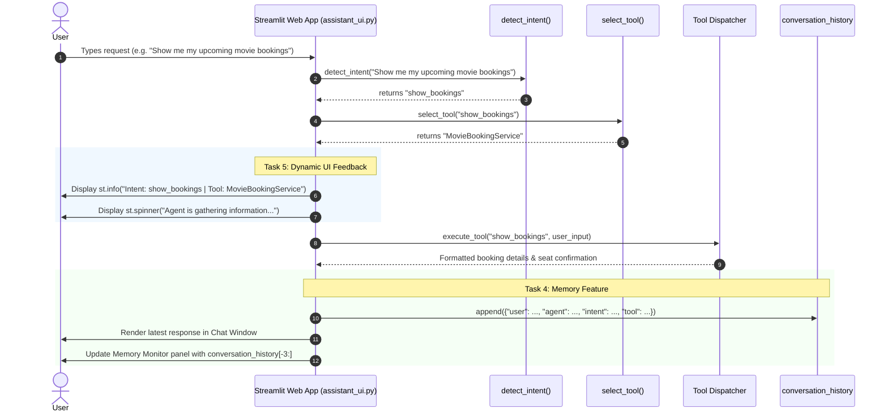

# Session 25 - Case Study: Building a Personal Assistant Agent (Part 2)

This directory contains the complete implementation, interactive Web UI, and automated test suite for **Session 25: Building a Personal Assistant Agent (Part 2)**. 

In this session, the assistant advances from command-line scripts to an interactive **Streamlit Chat Application**, incorporating an intent detection classifier, autonomous tool selection, stateful conversation memory (with an active 3-exchange window), and real-time execution feedback indicators.

---

## 📋 Task Overview & File Mapping

| Task | Topic | Implementation File | Key Features |
| :--- | :--- | :--- | :--- |
| **Task 1** | Chat-like Interface | [`assistant_ui.py`](file:///d:/tops%20data/Agentic%20AI/Assignment/Session%2025/assistant_ui.py) | Streamlit web application providing a modern chat interface (`st.chat_message`, `st.chat_input`), intent/tool badges, and quick-action chips. |
| **Task 2** | Intent Detection | [`assistant_ui.py`](file:///d:/tops%20data/Agentic%20AI/Assignment/Session%2025/assistant_ui.py#L79-L101)<br>[`assistant_core.py`](file:///d:/tops%20data/Agentic%20AI/Assignment/Session%2025/assistant_core.py#L78-L135) | Function `detect_intent(user_input)` classifying user requests into distinct intents (`show_bookings`, `play_music`, `get_weather`, `calculate`, `check_expenses`, `get_news`, `get_quote`, etc.). |
| **Task 3** | Tool Selection | [`assistant_ui.py`](file:///d:/tops%20data/Agentic%20AI/Assignment/Session%2025/assistant_ui.py#L107-L130)<br>[`assistant_core.py`](file:///d:/tops%20data/Agentic%20AI/Assignment/Session%2025/assistant_core.py#L182-L198) | Function `select_tool(intent)` routing the detected intent to the appropriate service or API (`MovieBookingService`, `SpotifyAPI`, `OpenMeteoWeatherAPI`, `SafeMathCalculator`, etc.). |
| **Task 4** | Conversation Memory | [`assistant_ui.py`](file:///d:/tops%20data/Agentic%20AI/Assignment/Session%2025/assistant_ui.py#L273-L300) | Stateful list `conversation_history` stored in `st.session_state`. Explicitly displays the **last three exchanges** (`conversation_history[-3:]`) in a dedicated Memory Monitor panel. |
| **Task 5** | UI Action Feedback | [`assistant_ui.py`](file:///d:/tops%20data/Agentic%20AI/Assignment/Session%2025/assistant_ui.py#L248-L260) | Real-time status transitions using `st.info` (intent & routing announcement) and `st.spinner` (gathering information / executing task loading animation). |
| **Testing** | Automated Test Suite | [`test_session25.py`](file:///d:/tops%20data/Agentic%20AI/Assignment/Session%2025/test_session25.py) | 11 unit and integration tests verifying `detect_intent`, `select_tool`, tool execution, and the 3-exchange memory sliding window. |

---

## 🏗️ Architecture & Interaction Flow



---

## 🔍 Task-by-Task Implementation Details

### 1. Task 1: Chat Interface (`assistant_ui.py`)
- Built using **Streamlit**'s native chat layout (`st.chat_message("user")`, `st.chat_message("assistant")`, and `st.chat_input`).
- Includes visual status badges on each response showing:
  - `🎯 Intent: <intent_name>`
  - `🛠️ Tool: <tool_name>`
- Two-column dashboard:
  - **Left column (60%)**: Interactive chat workspace.
  - **Right column (40%)**: Live Agent Memory Monitor inspecting `conversation_history[-3:]` and raw JSON telemetry.
- **Sidebar**: Quick-action prompt chips for instant 1-click testing of all intents.

### 2. Task 2: `detect_intent(user_input)`
- Analyzes natural language queries using tokenization, phrase matching, and regex scoring:
  - `"Show me my upcoming movie bookings"` $\rightarrow$ `'show_bookings'`
  - `"Play some upbeat jazz music on Spotify"` $\rightarrow$ `'play_music'`
  - `"What is the weather in Ahmedabad?"` $\rightarrow$ `'get_weather'`
  - `"Calculate 23+7*2"` $\rightarrow$ `'calculate'`
  - `"How much did I spend on Food?"` $\rightarrow$ `'check_expenses'`
  - `"Show me top tech news"` $\rightarrow$ `'get_news'`
  - `"Inspire me with a quote"` $\rightarrow$ `'get_quote'`
  - Substring & empty input fallback $\rightarrow$ `'unknown'`

### 3. Task 3: `select_tool(intent)`
- Maps intents to dedicated services/APIs:
  | Detected Intent | Selected Tool / API | Action |
  | :--- | :--- | :--- |
  | `show_bookings` | `MovieBookingService` | Retrieves cinema tickets, auditorium, showtimes, seats |
  | `play_music` | `SpotifyAPI` | Starts playback stream, sets genre/track, speaker control |
  | `get_weather` | `OpenMeteoWeatherAPI` | Connects to Open-Meteo API (from Session 24) |
  | `calculate` | `SafeMathCalculator` | Evaluates math via Recursive Descent Parser (no `eval`) |
  | `check_expenses` | `ExpenseTrackerService` | Calculates category sum from `my_expenses.csv` |
  | `get_news` | `GNewsAPI` | Retrieves top 3 tech headlines |
  | `get_quote` | `MotivationalQuoteGenerator` | Generates quote via LLM / curated AI engine |
  | `unknown` | `DefaultHelpAssistant` | Displays helpful query suggestions |

### 4. Task 4: Memory Feature (`conversation_history`)
- `st.session_state.conversation_history` accumulates exchanges throughout the session:
  ```python
  exchange_record = {
      "user": user_input,
      "agent": agent_response,
      "intent": detected_intent,
      "tool": selected_tool,
      "timestamp": "15:24:10"
  }
  st.session_state.conversation_history.append(exchange_record)
  ```
- **Constraint Compliance**: The UI explicitly slices and displays the **last three exchanges**:
  ```python
  recent_exchanges = st.session_state.conversation_history[-3:]
  ```
- Includes a `"Clear Conversation Memory"` button to reset agent state at any time.

### 5. Task 5: Dynamic UI Feedback (`st.spinner` & `st.info`)
- When a request is submitted, the assistant executes a two-phase feedback cycle:
  1. `st.info(f"🎯 **Intent Detected:** '{detected_intent}' | 🛠️ **Routing to Tool:** '{selected_tool}'")`
  2. `with st.spinner(f"⏳ Agent is gathering information and executing task via **{selected_tool}**..."):`
- Gives users immediate visual feedback that information is being gathered before rendering the final output.

---

## 🚀 How to Run the Streamlit Application

Launch the web app locally from the repository root:

```bash
streamlit run "Assignment/Session 25/assistant_ui.py"
```

The app will open automatically in your browser at:
`http://localhost:8501`

---

## 🧪 Automated Test Suite

A headless test suite validates all functions, intent matches, tool mappings, and memory windowing:

```bash
python -u "Assignment/Session 25/test_session25.py"
```

### Test Coverage (11 Tests):
- ✅ `test_detect_intent_movie_bookings`: Validates `show_bookings` intent.
- ✅ `test_detect_intent_play_music`: Validates `play_music` intent.
- ✅ `test_detect_intent_weather`: Validates `get_weather` intent.
- ✅ `test_detect_intent_math_calculator`: Validates `calculate` intent.
- ✅ `test_detect_intent_expenses`: Validates `check_expenses` intent.
- ✅ `test_detect_intent_news`: Validates `get_news` intent.
- ✅ `test_detect_intent_quote`: Validates `get_quote` intent.
- ✅ `test_detect_intent_fallback`: Validates fallback on unknown/empty inputs.
- ✅ `test_select_tool_mapping`: Validates tool routing for all intents.
- ✅ `test_memory_feature_and_last_three_window`: Validates `conversation_history` accumulation and the active `[-3:]` memory window.
- ✅ `test_execute_tool_outputs`: Validates non-empty formatted outputs across all tools.
